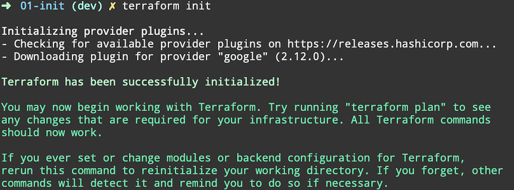
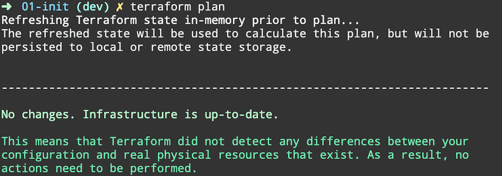
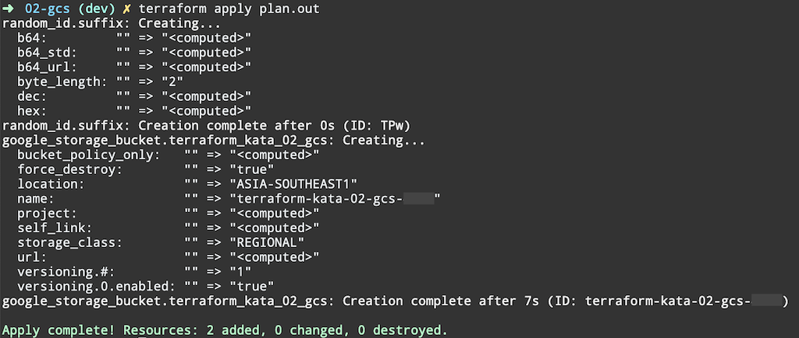

# GCP IaC - Terraform and Cloud Foundation Toolkit

## **Prerequisite**

You should have [Google Cloud SDK](https://cloud.google.com/sdk/docs/downloads-interactive) installed and configured before continuing, otherwise refer to [00-Setup/README.md](../../00-Setup/README.md)


## **Fundamental 01-init**

This lab helps you install and setup Terraform to work with Google Cloud Platform.

At the end of the exercise, you will have 2 GCS buckets (**Logs** and **Remote State**) with 4 lines of output value

**Note**: You can have input variables as

* **default** in `variables.tf`
* using [terraform.tfvars](https://www.terraform.io/docs/configuration/variables.html#variable-definitions-tfvars-files)
* command line argument `-var='key=value'`


### What You’ll Learn

*   Install [Hashicorp Terraform](https://www.terraform.io/)
creating-managing-service-account-keys#iam-service-account-keys-create-gcloud)
*   [Provider](https://www.terraform.io/docs/configuration/providers.html) block
*   [Resource](https://www.terraform.io/docs/configuration/resources.html) block
*   [Output](https://www.terraform.io/docs/configuration/outputs.html) block
*   [Local](https://www.terraform.io/docs/configuration/locals.html) values
*   Initialize Terraform with local state
*   Grant IAM Role (**Storage Admin**)
*   Random ID generation
*   Create and Destroy GCS Bucket
*   Create another GCS Bucket for remote state for following exercises

## Prerequisite

You should have [Google Cloud SDK](https://cloud.google.com/sdk/docs/downloads-interactive) installed and configured before continuing, otherwise refer to [00-Setup/README.md](../../00-Setup/README.md)


## Task 1. Install Terraform

### Install latest version for your OS

[Download Terraform](https://www.terraform.io/downloads.html)

#### Cloud Shell

**Note**: Cloud Shell comes with Terraform v0.12.9 built-in, you can skip to 3. Verify, or continue if you would like to install the latest version (as of December 2019).

1. Download version v0.12.18 (MacOS)

```
wget https://releases.hashicorp.com/terraform/0.12.18/terraform_0.12.18_darwin_amd64.zip
```

2. Uncompress downloaded file

```
unzip terraform_0.12.18_darwin_amd64.zip
```

3. Verfiy

```
./terraform version
```

move Terraform binary to `/usr/local/bin`

```
sudo mv terraform /usr/local/bin/
```

Alias for easy typing

```
alias tf='terraform'
```

## Task 2. Terraform

### Google Cloud Provider

Fill in `provider` block in `main.tf`


###  Terraform Init

[terraform init](https://www.terraform.io/docs/commands/init.html) command is used to initialize a working directory containing Terraform configuration files.


```
terraform init
```

A successful `terraform init` output will look like



###  Terraform Plan

[terraform plan](https://www.terraform.io/docs/commands/plan.html) command is used to create an execution plan. Terraform performs a refresh, unless explicitly disabled, and then determines what actions are necessary to achieve the desired state specified in the configuration files.

```
terraform plan
```

A successful `terraform plan` output will look like without any resources




## Task 3. GCS Bucket

### Terraform Configuration

1. Fill in the [random_id](https://www.terraform.io/docs/providers/random/r/id.html) resource block following documentation

2. Create a new GCS bucket following documentation [google_storage_bucket](https://www.terraform.io/docs/providers/google/r/storage_bucket.html) for Logs

#### Terraform Plan

Update Project ID in `variables.tf`

Validate execution plan will create 1 GCS bucket with Random Suffix

```
terraform plan -out=plan.out
```


#### Terraform Apply

Execute previous generated execution plan

```
terraform apply plan.out
```


#### Verify

[gsutil](https://cloud.google.com/storage/docs/gsutil) is a Python application that lets you access Cloud Storage from the command line.

It is installed as part of Google Cloud SDK.

```
gsutil ls
```

You will see the newly created GCS bucket listed as `gs://BUCKET_NAME`

Look inside the folder `.terraform/plugins/<YOUR_OS>/` you will see there are now 2 providers, for Google and Random

Inspect `terraform.tfstate` to see resources managed the local Terraform state file


#### Terraform Destroy

Destroy the resources (random_id, google_storage_bucket)

```
terraform destroy
```


## Task 4. GCS Bucket for Remote State

### Terraform Configuration

1. Fill in Task 4 resource block in `main.tf` to create a Remote State GCS bucket
2. Fill in `outputs.tf` and output name of the 2 GCS bucket


## Task 5. Cloud KMS Key Ring & Key

### Terraform Configuration

1. Fill in Task 5.1 resource blocks in `main.tf` to create a Cloud KMS Key Ring & Key
2. Fill in `outputs.tf` and output link to Key Ring & Key


## Bonus Task. Use local value to reduce repeatition

Find values that are repeating and use local variables instead so it's easier to change in a single place
