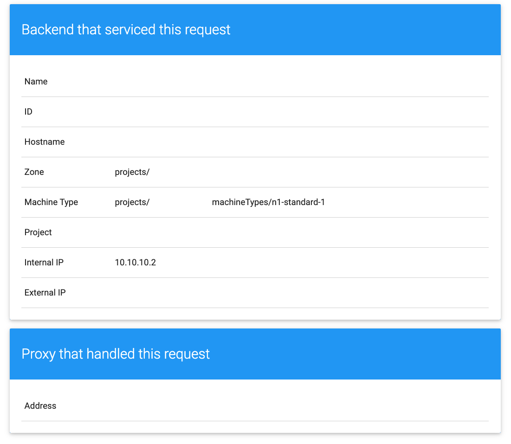

# Cloud Foundation Toolkit Lab - 05-Load-Balancer
[](https://ssh.cloud.google.com/cloudshell/editor?cloudshell_git_repo=https%3A%2F%2Fgithub.com%2Fterraform-google-modules%2Fcloud-foundation-training&cloudshell_git_branch=master&cloudshell_open_in_editor=main.tf&cloudshell_tutorial=README.md&cloudshell_working_dir=05-Load-Balancer)

## Prerequisite

Complete previous labs
* [00-Setup](https://github.com/terraform-google-modules/cloud-foundation-training/tree/master/00-Setup/README.md)
* [01-Getting-Started](https://github.com/terraform-google-modules/cloud-foundation-training/tree/master/01-Getting-Started/README.md)
* [02-IAM](https://github.com/terraform-google-modules/cloud-foundation-training/tree/master/02-IAM/README.md)
* [03-Networking](https://github.com/terraform-google-modules/cloud-foundation-training/tree/master/03-Networking/README.md)
* [04-Instance-Group](https://github.com/terraform-google-modules/cloud-foundation-training/tree/master/04-Instance-Group/README.md)

You should have [Google Cloud SDK](https://cloud.google.com/sdk/docs/downloads-interactive) installed and configured before continuing, otherwise refer to [00-Setup](https://github.com/terraform-google-modules/cloud-foundation-training/tree/master/00-Setup/README.md)

## Global HTTP(S) Load Balancer

This lab helps you create a Global HTTP(S) Load Balancer using Cloud Foundation Toolkit.

At the end of this exercise, you'll have a global HTTP(S) Load Balancer with a single external IP backed by the Managed Instance Group VM instances you've created in the [04-Instance-Group](https://github.com/terraform-google-modules/cloud-foundation-training/tree/master/04-Instance-Group/README.md) labs.

### What You'll Learn

* [Cloud Foundation Toolkit](https://cloud.google.com/foundation-toolkit/)
* [terraform-google-lb-http](https://github.com/terraform-google-modules/terraform-google-lb-http)
* [Global HTTP(S) Load Balancer](https://cloud.google.com/load-balancing/docs/https)


## Task 1. Create HTTP Load Balancer

Use the Cloud Foundation Toolkit [Global HTTP(S) Load Balancer](https://github.com/terraform-google-modules/terraform-google-lb-http) module in main.tf to create a Global HTTP Load Balancer with Managed Instance Group from [04-Instance-Group](https://github.com/terraform-google-modules/cloud-foundation-training/tree/master/04-Instance-Group/README.md) as the backend

**VPC Network**, **Cloud NAT**, **Instance Template** and **Managed Instance Group** provided in `network.tf` and `mig.tf`

## Task 2. Configurations

### backend.tf

Fill in backend.tf the bucket name created from [00-Setup](https://github.com/terraform-google-modules/cloud-foundation-training/tree/master/00-Setup/README.md)

### terraform.tfvars

Make a copy of the example `.tfvar` file and populate details.
```bash
cp terraform.example.tfvars terraform.tfvars
```

**Note**: You can have input variables as

* **default** in variables.tf
* using [terraform.tfvars](https://www.terraform.io/docs/configuration/variables.html#variable-definitions-tfvars-files)
* command line argument `-var='key=value'`

## Task 3. Terraform

### Terraform Init & Plan
Initialize Terraform
```bash
terraform init
```

Review Terraform execution plan
```bash
terraform plan -out=plan.out
```

### Terraform Apply

Execute previous generated execution plan

```bash
terraform apply plan.out
```

## Task 4. Verify

On [Google Cloud Console](https://console.cloud.google.com/), navigate to **Network services -> Load balancing**

Review the new **Load Balancer**

From the output of `terraform apply`, you will see the External IP for load balancer (`load_balancer_ip`)

Open a browser and enter the IP address, you should see a response similar to the image below



## Task 5. Clean Up

Destroy resources created by Terraform

```bash
terraform destroy
```

## Congratulations

<walkthrough-conclusion-trophy></walkthrough-conclusion-trophy>

You’re all set! You can now move on to the next lab.
